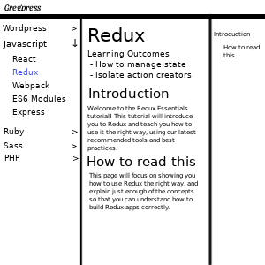

# gregpress

A personal blogging platform with main focus sharing information and presenting it in a easy-to-find format.

## Post

A post will have a category, include some text/image/code and may be divided into chapters.

- Only the admin can create posts
- Posts can be commented on
- Posts will have a single category
- Posts will have one or more chapters

## Users

Users will interact with the blog site and will be divided between admin/non-admins

- Email (String)
- Name (String)
- Date (Date)
- passwordHash (String)
- admin (Bool)

### profilePicture

- Allow users to upload pictures. https://www.npmjs.com/package/express-fileupload
- Uploaded images will be split into differant sizes.
- Users can set profile picture

### resetToken

- Reset password endpoints (POST /api/lost-password, {email: some@email.com}))
- User passes email to controller
- Controller finds that user, creates a token and saves to that user's resetToken
- Expire resetToken in (30 or 60) minutes
- Send link to email with user email and token in link
- user clicks link and is presented with a new form for submitting a new password (GET /api/lost-password/ {email: some@email.com, token: 'askoemaokmse' }
